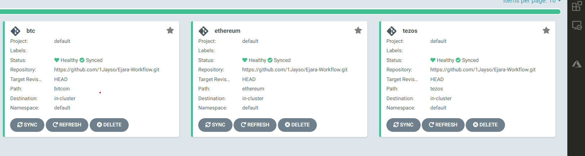

# Ejara Test Submission
<!-- # DigitalOcean Kubernetes Challenge  -->

>I was able to successfully deploy the applications follwing the instructions given. 
>I used github actions for the CI and argocd for the continous deployment. I interfaced the nodes with Kong's API gateway.
>To access the bitcoin, ethereum, tezos rpc server you would need to use this IP and each nodes endpoint respectively: ["35.184.26.103/bitcoin", "35.184.26.103/ethereum", "35.184.26.103/tezos"]

- You can access the argocd dashboard via this IP address 35.193.103.196 
- The dasboard credentials are as follows username=admin password=sudo12345. This will help you visualize the cluster and health statuses of the nodes.
- Below is an image of the nodes from the argocd dashboard.

## Links to Repos
https://github.com/1Jayso/bitcoin
https://github.com/1Jayso/go-ethereum

## Challenges Encountered
- I lacked the domain knowledge so it was a bit dounting for me trying to connect to the rpc server of the nodes after deployment.

## Final Remarks 
- I believe that when given the opportunity I can work with the developers to understand the workings of a blockchain to better aid in my subsequent deployment. This was fun by the way :). I hope to hear from you soon. Thanks.
